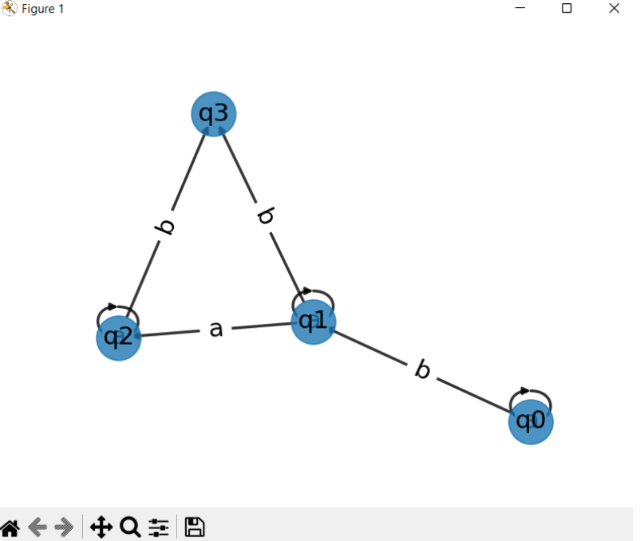

# Determinism in Finite Automata. Conversion from NFA to DFA. Chomsky Hierarchy.
## Course: Formal Languages & Finite Automata
## Author: Gazea Sandu FAF-211

Variant 13

Q = {q0,q1,q2,q3},

∑ = {a,b},

F = {q3},

δ(q0,a) = q0,

δ(q0,b) = q1,

δ(q1,a) = q1,

δ(q1,a) = q2,

δ(q1,b) = q3,

δ(q2,a) = q2,

δ(q2,b) = q3.


## Theory
A finite automaton is like a device that represents different processes, kind of like a state machine. It has a starting point and a set of endpoints, so any process it represents has a clear beginning and end.

Sometimes, depending on how the automaton is structured, there can be situations where one action can lead to multiple states, which makes things less predictable. Determinism is a term used in systems theory to describe how predictable a system is. When there are random elements involved, the system becomes less predictable or stochastic.

Because of this, automata can be classified as either deterministic or non-deterministic. We can make an automaton deterministic by using algorithms that change its structure.

The Chomsky Hierarchy is a way of categorizing formal languages based on how complex their grammars are. There are four categories: regular languages, context-free languages, context-sensitive languages, and recursively enumerable languages.

A non-deterministic finite automaton (NFA) is a type of automaton where a given input symbol can lead to multiple transitions from a specific state. On the other hand, a deterministic finite automaton (DFA) is an automaton where a given input symbol can only lead to one transition from a specific state.

To convert an NFA to a DFA, we need to create a new DFA that accepts the same language as the NFA. We create a state in the DFA for every possible combination of states in the NFA. The transitions between states in the DFA are determined by examining all possible transitions from each state in the NFA for each input symbol. If a set of states in the NFA includes a final state, then the corresponding state in the DFA is also a final state.
## Objectives:
- Understand what an automaton is and what it can be used for.

- Continuing the work in the same repository and the same project, the following need to be added:

  a. Provide a function in your grammar type/class that could classify the grammar based on Chomsky hierarchy.

  b. For this you can use the variant from the previous lab.

- According to your variant number (by universal convention it is register ID), get the finite automaton definition and do the following tasks:

  a. Implement conversion of a finite automaton to a regular grammar.

  b. Determine whether your FA is deterministic or non-deterministic.

  c. Implement some functionality that would convert an NDFA to a DFA.

  d. Represent the finite automaton graphically:
    - You can use external libraries, tools or APIs to generate the figures/diagrams.
    - Your program needs to gather and send the data about the automaton and the lib/tool/API return the visual representation.

## Implementation description
### 'is_deterministic' method
This code examines whether the finite automaton described by the object is deterministic or not. It achieves this by constructing a transition map that associates the current state and input symbol with a set of subsequent states. If any state in the automaton has multiple transitions for the same input symbol, it implies that the automaton is non-deterministic. In such cases, the method will return false. Conversely, if each state in the automaton has only one transition for each input symbol, it indicates determinism, and the method will return true. The method doesn't require any parameters and delivers a boolean value as its output.

```python
 def is_deterministic(self):
        # Checks if the automaton is deterministic
        for state in self.states:
            for symbol in self.alphabet:
                next_states = self.transitions.get((state, symbol), set())
                if len(next_states) != 1:
                    return False
        return True
```
### `to_dfa` method
This function converts a non-deterministic finite automaton (NFA) into a deterministic finite automaton (DFA). It accomplishes this by following a series of steps. First, it generates a power set, which is a set of all possible combinations of states in the NFA. This is done using the "getPowerSet" method, which returns a set containing sets representing these combinations.

Next, the code creates a new transition table for the DFA. It iterates over each state set in the power set and examines the possible transitions from each state in the current state set for each input symbol in the alphabet. Based on these transitions, it generates a set of next states for each symbol.

Finally, the code constructs a new DFA using the obtained transition table, along with the final states and initial state of the NFA. The new DFA is initialized with these values, completing the conversion process.

```python
    def to_dfa(self):
        # Converts the automaton to a deterministic finite automaton (DFA)
        if self.is_deterministic():
            return self

        dfa_states = set()
        dfa_accept_states = set()
        dfa_transitions = dict()
        state_queue = [frozenset([self.start_state])]
        while state_queue:
            current_states = state_queue.pop(0)
            dfa_states.add(current_states)
            if any(state in self.accept_states for state in current_states):
                dfa_accept_states.add(current_states)
            for symbol in self.alphabet:
                next_states = set()
                for state in current_states:
                    next_states |= set(self.transitions.get((state, symbol), set()))
                if next_states:
                    next_states = frozenset(next_states)
                    dfa_transitions[(current_states, symbol)] = next_states
                    if next_states not in dfa_states:
                        state_queue.append(next_states)

        dfa = Automaton()
        dfa.states = dfa_states
        dfa.accept_states = dfa_accept_states
        dfa.transitions = dfa_transitions
        return dfa
```

### `chomsky_classification` method
The "chomsky_classification" method verifies whether a given grammar adheres to Chomsky Normal Form (CNF) and determines the type of the grammar based on Chomsky's hierarchy. It examines each production in the grammar to ensure it satisfies the requirements of CNF. These requirements specify that each production should consist of either a single terminal symbol, a pair of nonterminal symbols, or a production that generates the empty string.

If any production fails to meet these criteria, the method determines the grammar's type according to Chomsky's hierarchy. Additionally, if the start symbol has a production that solely produces the empty string, the method further examines whether there are other productions for the start symbol to make a classification decision.

If the start symbol lacks a production that solely generates the empty string, the grammar is considered context-free. Based on these evaluations, the method assigns one of the four types of grammar in Chomsky's hierarchy: Type 0 (Unrestricted Grammar), Type 1 (Context-Sensitive Grammar), Type 2 (Context-Free Grammar), or Type 3 (Regular Grammar).


```python
 def chomsky_classification(self):
        for symbol, productions in self.productions.items():
            for production in productions:
                if len(production) == 1 and production.islower():
                    continue
                elif len(production) == 2 and production.isupper():
                    continue
                elif len(production) == 1 and production.isupper():
                    return "Type 0: Unrestricted Grammar"
                elif len(production) != 2 or not production.isupper():
                    return "Type 1: Context-Sensitive Grammar"

        if self.start_symbol in self.productions and 'ε' in self.productions[self.start_symbol]:
            if len(self.productions[self.start_symbol]) > 1:
                return "Type 2: Context-Free Grammar"
            else:
                return "Type 3: Regular Grammar"
        else:
            return "Type 2: Context-Free Grammar"
```
### Render function

The "render" function is responsible for visually representing a deterministic finite automaton (DFA) as a directed graph. It utilizes two libraries, networkx and matplotlib, to accomplish this task.
First, the function creates a directed graph using the networkx library. Each state in the DFA is represented as a node in the graph. Notably, the start state and accept states are distinguished by using different shapes for their nodes.
Next, the function adds edges to the graph to depict the transitions between states. These edges represent the paths that can be taken based on input symbols. The function also labels these edges with the symbols that trigger the respective transitions.
To ensure an organized layout, the function utilizes the spring_layout algorithm provided by networkx to position the nodes appropriately within the graph.
Finally, the graph is rendered using the matplotlib library. The resulting visualization illustrates the states of the DFA as nodes and the transitions between them as edges, effectively providing a visual representation of the DFA and its behavior.
```python
    def render(self):
        # Create a directed graph using networkx
        G = nx.DiGraph()

        # Add nodes to the graph
        for state in self.states:
            G.add_node(state, shape='circle')
        G.nodes[self.start_state]['shape'] = 'doublecircle'
        for state in self.accept_states:
            G.nodes[state]['peripheries'] = 2

        # Add edges to the graph
        for (from_state, symbol), to_states in self.transitions.items():
            for to_state in to_states:
                G.add_edge(from_state, to_state, label=symbol)

        # Set up positions for the nodes using networkx spring_layout
        pos = nx.spring_layout(G, seed=42)

        # Draw the graph using matplotlib
        nx.draw_networkx_nodes(G, pos, node_size=1000, alpha=0.8)
        nx.draw_networkx_edges(G, pos, width=2, alpha=0.8)
        nx.draw_networkx_labels(G, pos, font_size=18, font_family='sans-serif')
        edge_labels = {(u, v): d['label'] for u, v, d in G.edges(data=True)}
        nx.draw_networkx_edge_labels(G, pos, edge_labels=edge_labels, font_size=18, font_family='sans-serif')
        plt.axis('off')
        plt.show()
```

## Results
```
Is automaton deterministic? False
DFA states: {frozenset({'q1'}), frozenset({'q3'}), frozenset({'q0'}), frozenset({'q1', 'q2'})}
DFA transition function: {(frozenset({'q0'}), 'a'): frozenset({'q0'}), (frozenset({'q0'}), 'b'): frozenset({'q1'}), (frozenset({'q1'}), 'a'): frozenset({'q1', 'q2'}), (frozenset({'q1'}), 'b'): frozenset({'q3'}), (frozenset({'q1', 'q2'}), 'a'): frozenset({'q1', 'q2'}), (frozenset({'q1', 'q2'}), 'b'): frozenset({'q3'})}
DFA initial state: q0
DFA final states: {frozenset({'q3'})}
Regular grammar productions: ('q0', {'q1': {'aS', 'aq1', 'b', 'bq0'}, 'q2': {'aS', 'aq2', 'aq1', 'b'}, 'S': {'aq0'}})
Type 1: Context-Sensitive Grammar
```
<div align="center">
    
</div>

## Conclusions

In this lab work, I gained a better understanding of determinism in Finite Automata, NFA to DFA conversion, and Chomsky Hierarchy.
In the "FiniteAutomaton" class, I implemented methods like "convertToRegularGrammar," "isDeterministic," "convertToDFA," "getPowerSet," and "transitionsFrom." These methods handle automata operations and transitions.
In the "Grammar" class, I added methods such as "classifyGrammar," "isRegularGrammar," "isContextFreeGrammar," and "isContextSensitiveGrammar." These methods analyze and identify different grammar types.
Overall, this lab work improved my knowledge of determinism, NFA to DFA conversion, and Chomsky Hierarchy.